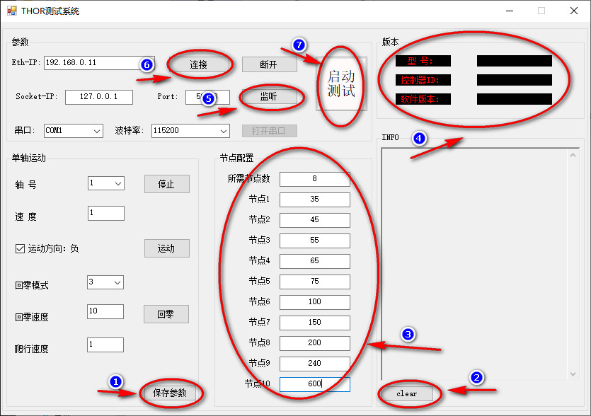

# THOR测试系统的简单说明
> 软件用c#语言开发    
> 功能包括连接以太网控制器及本地UDP之Socket连接
#### 软件界面如下:

###### 简单说明:
> 1. 功能说明:
>     1. 修改参数后，点击'1'指向的按键保存
>     2. '2'所指的按键，清空'INFO'显示
>     3. '3'指向的每一个文本框内容不能为空且必须是无符号整数
>     4. 测试前，点击'6'，'4'处有版本信息表明成功连接到控制器
>     5. 测试前，点击'5'，开始监听拉力数据
>     6. 就绪后，点击'7'即可启动测试(按键颜色会变绿并且文字变为"测试中")
>     7. 设置的节点测试完后，电机自动归位，'7'处文字变为"启动测试"
> 2. 实际使用时，需注意:
>     1. 务必将控制器与电脑用网线连接好
>     2. 务必在使用时确保Python客户端已开启
>     3. 若遇到运行时异常请及时联系工程师
> 3. 每一节点与实际读到的力的判定偏差为±5%
##### 测试人员注意事项:
> 1. 完成操作后，请将INFO区域内的文本复制后反馈给TLY
> 2. 测试中发现的Bug请详细说明，并及时反馈给TLY
---    
*以上内容由TLY编辑，联系方式：taoliyong@tacsense.cn*